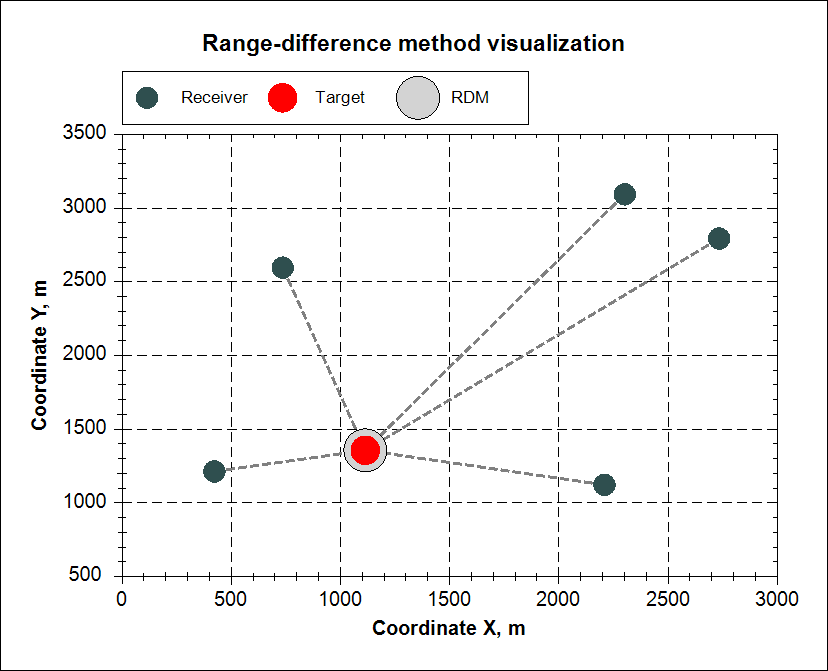

<p align="center"></p>  

**Range-difference method** implementation using C#.   

# Abstract
One of the most common methods for determining the coordinates of a target in passive systems of positioning is the range-difference method (**RDM**). As a navigation parameter the RDM uses the difference of distances from the target to the spaced synchronized receivers determined by mutual time delay of the received signals.  
The RDM for determining the target coordinates can be implemented for 5 (or more) time-synchronized receivers by solving a **linearized system of equations** [1] and for 2, 3 (for 1D, 2D coordinates) or 4 (for 3D coordinates) receivers by solving a **nonlinear system of equations** [2, 3]. This implementation uses both algorithms and can finds the coordinates of the target for **2 or more receivers**.  

<p align="center"></p>  
<p align="center"><b>Figure 1.</b> Multiposition Satellite System</p>  

# Installation
Download from [**release**](release) folder and add **RDM.dll** to your project.  
```c#
using RDM;
```

# Code
Download and build all projects from [**sources**](sources) folder.  

## Console application
It simulates the situation of receiving data from a map about the location of the target in **geodetic coordinates** [4]. The coordinates are transformed from geodetic to Cartesian, and receivers are randomly placed in accordance with the scaling vector, and the time delays of the signal are calculated. The **RDM** is applied, and target coordinates and quality metrics are calculated. Finally, the the target coordinates are transformed back to geodetic coordinates.  
  
Run ***RDM_CONSOLE.exe***  

```
Target (Geodetic): 80, 20, 100
Target (Cartesian): 1044169.258983, 380046.529794, 6259644.553094
Scaling (Cartesian): 726, 958, 842
Sigma: 0.5
Receivers count: 4

Receiver: 1044474.41442, 380394.666302, 6259500.766351
Receiver: 1043803.316403, 380529.724811, 6259428.541315
Receiver: 1044788.868008, 379824.457678, 6259053.5133
Receiver: 1044880.813523, 380896.82371, 6258905.820383
Time delays: 2E-06, 2E-06, 3E-06, 4E-06
RDM (Cartesian): 1044169.258754, 380046.530863, 6259644.547745

Accuracy: 0.99999999917584
Similarity: 1
Loss: 0.00664581422461197

RDM (Geodetic): 80, 20, 99.994759
```

## Windows.Forms application
It simulates two models: random placement of receivers at a fixed location of the target and random placement of the target at fixed locations of the receivers. The coordinates of objects are visualized using [**ZedGraph**](https://sourceforge.net/projects/zedgraph/) and the **RDM** is applied.  

Run ***RDM_VISUAL.exe***, apply settings and press "*Generate*" button.  
Double click on the graph and save the image.  

<p align="center"></p>  
<p align="center"><b>Figure 2.</b> Saved graph image</p>  

# License
**GNU GPL v3.0**  

# References
[1] **I.V. Grin, R.A. Ershov, O.A. Morozov, V.R. Fidelman** - Evaluation of radio source’s coordinates based on solution of linearized system of equations by range-difference method ([***pdf***](https://cyberleninka.ru/article/n/otsenka-koordinat-istochnika-radioizlucheniya-na-osnove-resheniya-linearizovannoy-sistemy-uravneniy-raznostno-dalnomernogo-metoda/pdf)).  
[2] **V.B. Burdin, V.A. Tyurin, S.A. Tyurin, V.M. Asiryan** - The estimation of target positioning by means of the range-difference method (***not available yet***).  
[3] **E.P. Voroshilin, M.V. Mironov, V.A. Gromov** - The estimation of radio source positioning by means of the range-difference method using the multiposition passive satellite system ([***pdf***](https://cyberleninka.ru/article/n/opredelenie-koordinat-istochnikov-radioizlucheniya-raznostno-dalnomernym-metodom-s-ispolzovaniem-gruppirovki-nizkoorbitalnyh-malyh/pdf)).  
[4] Coordinate system on **Wiki** ([***page***](https://en.wikipedia.org/wiki/Coordinate_system)).  
